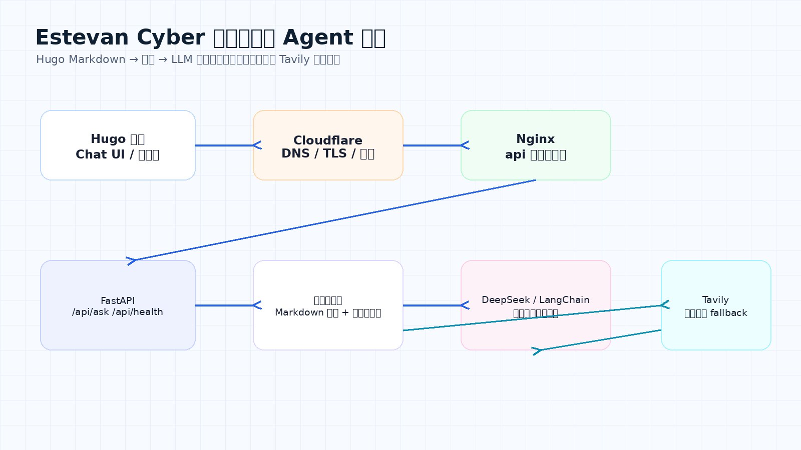
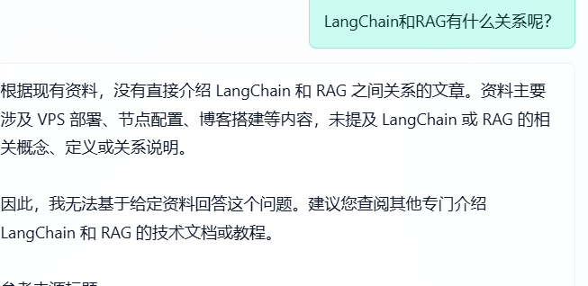
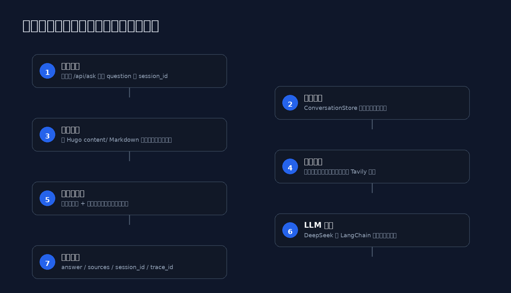
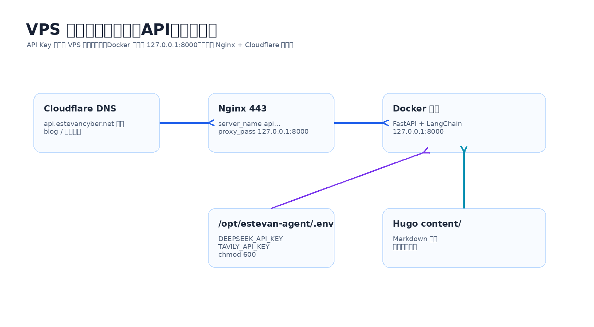

这篇文章记录我给个人网站做的一个 **AI Agent 问答系统**。

它的目标不是做一个泛用聊天机器人，而是让个人网站具备“基于站内文章回答问题”的能力：用户在网站上提问，后端先检索 Hugo 博客 `content/` 目录里的 Markdown 文章，再把相关片段交给 LLM 生成回答。如果本地资料不足，就通过 Tavily 进行联网搜索补充信息。

最终部署结构大致是：

```text
Hugo 博客文章
  ↓
Markdown 加载与切块
  ↓
本地关键词检索
  ↓
DeepSeek / LangChain 生成回答
  ↓
FastAPI 暴露接口
  ↓
Nginx + Cloudflare 提供 api.estevancyber.net
```



---

## 一、为什么做这个问答系统

我的博客里已经有不少关于 VPS、Cloudflare、AI Agent、Hermes、节点配置、Hugo 部署的记录。随着内容变多，单纯依赖菜单和搜索不够方便。

我希望实现一个更自然的入口：

```text
用户：Hermes Agent 怎么部署？
系统：从我的博客中检索 Hermes 相关笔记，整理成回答，并附上来源。
```

这个系统适合解决三类问题：

1. **站内知识问答**：快速从文章里提取答案。
2. **个人项目导航**：把博客、工具页、Agent 项目串起来。
3. **知识库增强**：当站内资料不够时，再调用联网搜索补充。

---

## 二、项目技术栈

当前项目主体是一个 FastAPI 服务：

```text
FastAPI      → 提供 /api/health、/api/ask、/api/reindex
LangChain    → 统一调用 DeepSeek 兼容 OpenAI 的接口
DeepSeek     → 负责最终回答生成
Tavily       → 本地资料不足时进行联网搜索
Docker       → 部署后端服务
Nginx        → 反向代理 api 子域名
Cloudflare   → DNS、TLS、代理访问
Hugo content → 本地知识库来源
```

项目 README 中的定位是：

```text
FastAPI + LangChain + DeepSeek 的个人网站知识库问答服务。
它读取 Hugo content/ 目录下的 Markdown，检索相关文章片段，再调用 DeepSeek 生成回答。
```

---

## 三、接口设计

后端核心接口有三个：

```text
GET  /api/health
POST /api/ask
POST /api/reindex
```

### 1. 健康检查

```bash
curl http://127.0.0.1:8000/api/health
```

用于确认服务是否正常、知识库文档和切片是否加载成功。

返回示例：

```json
{
  "status": "ok",
  "documents": 4,
  "chunks": 25
}
```

### 2. 提问接口

```bash
curl -X POST http://127.0.0.1:8000/api/ask \
  -H "Content-Type: application/json" \
  -d '{"question":"Hermes Agent 怎么部署？","session_id":"web"}'
```

返回字段包括：

```text
answer      → 模型生成的回答
sources     → 参考来源
session_id  → 会话 ID
trace_id    → 排错追踪 ID
```

### 3. 重新索引

```bash
curl -X POST http://127.0.0.1:8000/api/reindex
```

当我新增或修改博客文章后，可以用这个接口重新读取 Markdown 并切块。

---

## 四、本地知识库：从 Markdown 到 Chunk

知识库的数据源就是 Hugo 的 `content/` 目录。

加载逻辑大致是：

1. 遍历 `content/**/*.md`
2. 解析 front matter
3. 跳过 `draft: true` 的草稿
4. 清理 Markdown 语法
5. 生成文章 URL
6. 按固定长度切成 chunk

这样做的好处是：不需要额外维护数据库，博客文章本身就是知识库。

核心思想可以理解为：

```text
一篇 Markdown 文章
  ↓
清理格式
  ↓
按 900 字左右切块
  ↓
每个 chunk 保留 title / url / summary / tags
```

---

## 五、检索逻辑：先本地，再联网

最初版本只做本地关键词检索。

当我问：

```text
LangChain 和 RAG 有什么关系？
```

如果本地博客里没有相关内容，系统会回答：



这说明系统遵守了“只基于给定资料回答”的原则，但体验上不够好。因为用户问的是通用技术问题，完全可以通过联网搜索补充。

所以后面我加了 Tavily：

```text
本地检索分数足够高 → 只用本地资料回答
本地检索分数较低 → 触发联网搜索
没有 Tavily API Key → 自动降级为仅本地知识库
```

新增配置项：

```env
TAVILY_API_KEY=tvly-xxxxxxxxxx
ASK_AGENT_LOCAL_SCORE_THRESHOLD=2.0
```

其中：

```text
ASK_AGENT_LOCAL_SCORE_THRESHOLD 越高，越容易触发联网搜索。
```

---

## 六、请求处理流程

整体请求流程如下：



简单拆开看：

```text
1. 前端向 /api/ask 发送问题
2. FastAPI 接收 AskRequest
3. ConversationStore 读取历史上下文
4. KeywordRetriever 检索本地 Markdown chunks
5. 根据得分判断是否触发 Tavily 搜索
6. 组装 context
7. DeepSeek 生成回答
8. 返回 answer、sources、session_id、trace_id
```

这个流程里我比较重视两点：

### 1. 本地资料优先

个人网站问答系统的核心价值是“回答我自己的内容”，而不是变成另一个通用搜索引擎。

因此：

```text
本地知识库命中 → 优先引用本地文章
本地资料不足 → 再用联网搜索补充
```

### 2. 可观测性

后端日志会记录：

```text
trace_id
是否触发联网搜索
搜索结果数量
失败原因
```

这样出问题时更容易判断是：

```text
本地检索没命中
Tavily API Key 没进容器
Tavily 请求失败
DeepSeek 请求失败
Nginx / Docker 部署问题
```

---

## 七、LLM 生成：克制回答，不编造

系统提示词的核心原则是：

```text
只能基于给定资料回答；
如果资料不足，要直接说明不足；
关键结论尽量对应资料来源；
不要编造不存在的文章、项目或经历。
```

这是个人网站问答系统很重要的一点。

如果模型随便编造，就会让读者误以为我写过某篇文章或做过某个项目，反而降低可信度。

---

## 八、部署结构

最终 VPS 上的部署结构是：



我把 API 与主站分开：

```text
estevancyber.net        → Hugo 首页
blog.estevancyber.net   → Hugo 博客
tools.estevancyber.net  → 工具页
api.estevancyber.net    → FastAPI 问答服务
```

Nginx 只把 `api.estevancyber.net` 转发到本机 Docker：

```nginx
server {
    listen 443 ssl;
    listen [::]:443 ssl;
    server_name api.estevancyber.net;

    ssl_certificate /etc/nginx/ssl/estevancyber/origin.pem;
    ssl_certificate_key /etc/nginx/ssl/estevancyber/origin.key;

    location / {
        proxy_pass http://127.0.0.1:8000;
        proxy_http_version 1.1;

        proxy_set_header Host $host;
        proxy_set_header X-Real-IP $remote_addr;
        proxy_set_header X-Forwarded-For $proxy_add_x_forwarded_for;
        proxy_set_header X-Forwarded-Proto $scheme;
    }
}
```

容器只监听本机地址：

```bash
docker run -d --name estevan-knowledge-agent \
  -p 127.0.0.1:8000:8000 \
  --env-file /opt/estevan-agent/.env \
  estevan-knowledge-agent
```

这样公网不能直接访问 `8000`，只能通过 Nginx 和 Cloudflare 访问 API 域名。

---

## 九、API Key 安全配置

API Key 不应该写进代码，也不应该提交到 GitHub。

我在 VPS 上使用独立环境文件：

```text
/opt/estevan-agent/.env
```

示例：

```env
DEEPSEEK_API_KEY=你的DeepSeekKey
DEEPSEEK_MODEL=deepseek-chat
DEEPSEEK_BASE_URL=https://api.deepseek.com

TAVILY_API_KEY=你的TavilyKey
ASK_AGENT_LOCAL_SCORE_THRESHOLD=2.0

SITE_BASE_URL=https://blog.estevancyber.net
KNOWLEDGE_CONTENT_DIR=/app/content
ASK_AGENT_CORS_ORIGINS=https://blog.estevancyber.net,https://estevancyber.net
ASK_AGENT_RETRIEVER_LIMIT=4
ASK_AGENT_MAX_HISTORY_MESSAGES=8
```

设置权限：

```bash
sudo chmod 600 /opt/estevan-agent/.env
sudo chown root:root /opt/estevan-agent/.env
```

如果普通用户运行 Docker 读不到 `.env`，可以使用：

```bash
sudo docker run ...
```

不要为了方便把 `.env` 放到仓库里。

---

## 十、Docker 部署流程

完整部署流程如下：

```bash
cd ~/estevancyber-blog

git pull origin main

sudo docker rm -f estevan-knowledge-agent 2>/dev/null || true

sudo docker build --no-cache \
  -f agent-api/Dockerfile \
  -t estevan-knowledge-agent .

sudo docker run -d --name estevan-knowledge-agent \
  -p 127.0.0.1:8000:8000 \
  --env-file /opt/estevan-agent/.env \
  estevan-knowledge-agent
```

检查日志：

```bash
sudo docker logs estevan-knowledge-agent --tail=100
```

本机测试：

```bash
curl http://127.0.0.1:8000/api/health
```

公网测试：

```bash
curl https://api.estevancyber.net/api/health
```

提问测试：

```bash
curl -X POST https://api.estevancyber.net/api/ask \
  -H "Content-Type: application/json" \
  -d '{"question":"LangChain 和 RAG 有什么关系？","session_id":"prod-test"}'
```

---

## 十一、踩坑记录

### 1. Docker 镜像不存在

如果直接运行：

```bash
docker run estevan-knowledge-agent
```

可能报错：

```text
Unable to find image 'estevan-knowledge-agent:latest' locally
pull access denied
```

原因是本地还没有 build 镜像。要先执行：

```bash
docker build -f agent-api/Dockerfile -t estevan-knowledge-agent .
```

### 2. env 文件权限不足

如果 `.env` 是 `root:root + 600`，普通用户运行 Docker 可能报：

```text
--env-file: open /opt/estevan-agent/.env: permission denied
```

解决方式：

```bash
sudo docker run ...
```

或者调整文件属主，但我更倾向于保留 root 管理密钥文件。

### 3. 主站被 API 接管

如果 `estevancyber.net` 访问后出现：

```json
{"detail":"Not Found"}
```

这通常不是 Hugo 出错，而是 Nginx 把主站也转发到了 FastAPI。

正确做法是：

```text
api.estevancyber.net → proxy_pass 127.0.0.1:8000
estevancyber.net     → root /var/www/blog
blog.estevancyber.net→ root /var/www/blog
```

也就是 API 和主站必须用不同 server block。

### 4. 联网搜索没有触发

如果回答仍然只说“当前资料不足”，可以检查：

```bash
sudo docker exec estevan-knowledge-agent env | grep -E "TAVILY|ASK_AGENT_LOCAL"
sudo docker exec estevan-knowledge-agent python -c "from tavily import TavilyClient; print('tavily ok')"
```

如果容器里没有 `TAVILY_API_KEY`，说明 env 没传进去。  
如果无法 import Tavily，说明依赖没有打进镜像。

---

## 十二、下一步优化

目前这个问答系统已经具备基本能力：

```text
本地知识库检索
多轮会话
DeepSeek 生成回答
Tavily 联网补充
Docker 部署
Cloudflare + Nginx 暴露 API
```

后续我还想继续优化：

1. **向量检索**：从关键词检索升级到 embedding 检索。
2. **前端引用展示**：把 sources 以卡片形式显示出来。
3. **后台 reindex 按钮**：新增文章后不用手动 curl。
4. **访问频率限制**：防止 API 被滥用。
5. **日志面板**：查看 trace_id、搜索触发率和失败原因。
6. **私有知识扩展**：接入项目 README、学习笔记和部署文档。

---

## 总结

这个项目不是一个复杂的商业级 RAG 系统，但它已经完成了个人网站知识库问答的核心闭环：

```text
内容来自我自己的博客
问题由用户自然提出
检索优先使用本地知识
资料不足时联网补充
回答通过 API 返回给前端
部署在自己的 VPS 上
```

它也让我更直观地理解了 AI Agent / RAG 项目的几个关键点：

- 数据源比模型更重要。
- 部署边界要清楚，主站和 API 要分离。
- API Key 必须留在服务端。
- 日志和 trace_id 对排障很关键。
- 本地知识库和联网搜索应该互补，而不是互相替代。

从个人博客出发，做一个能回答自己内容的 AI Agent，是一个很适合写进简历和持续迭代的小项目。
