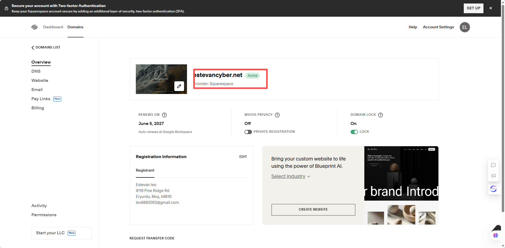
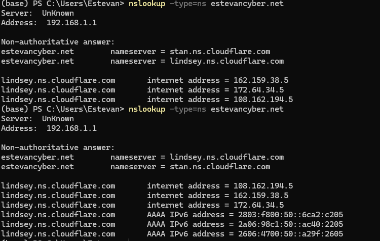
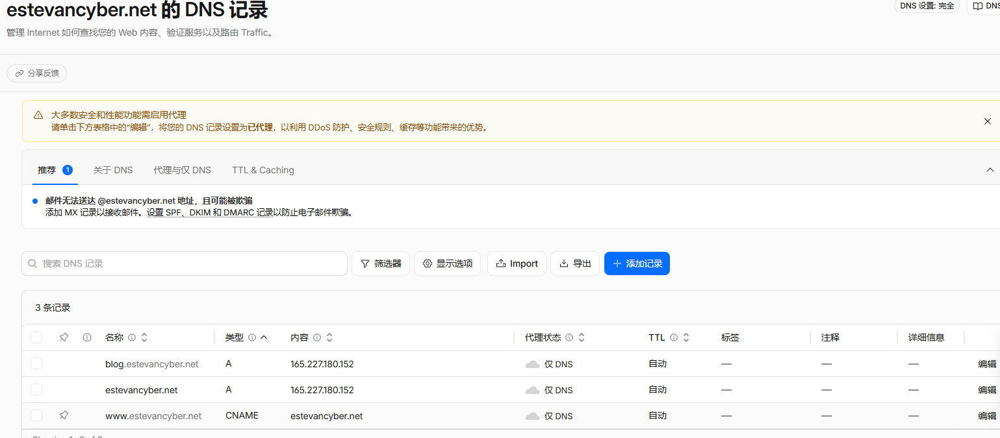
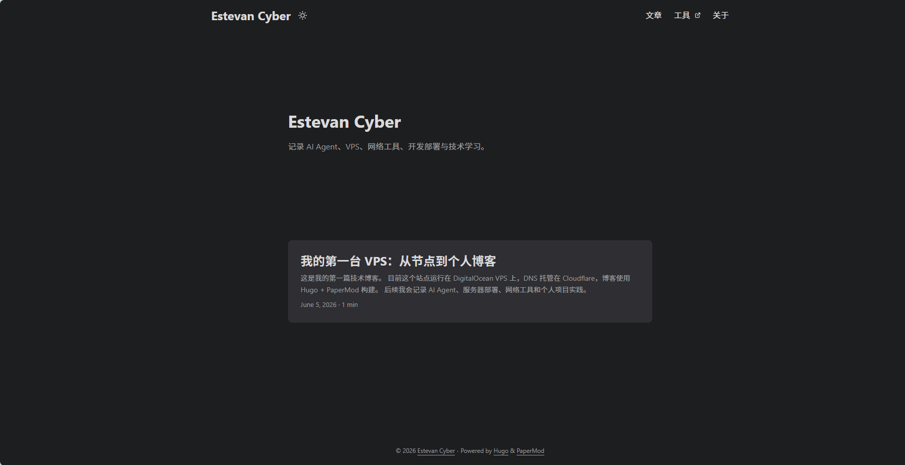
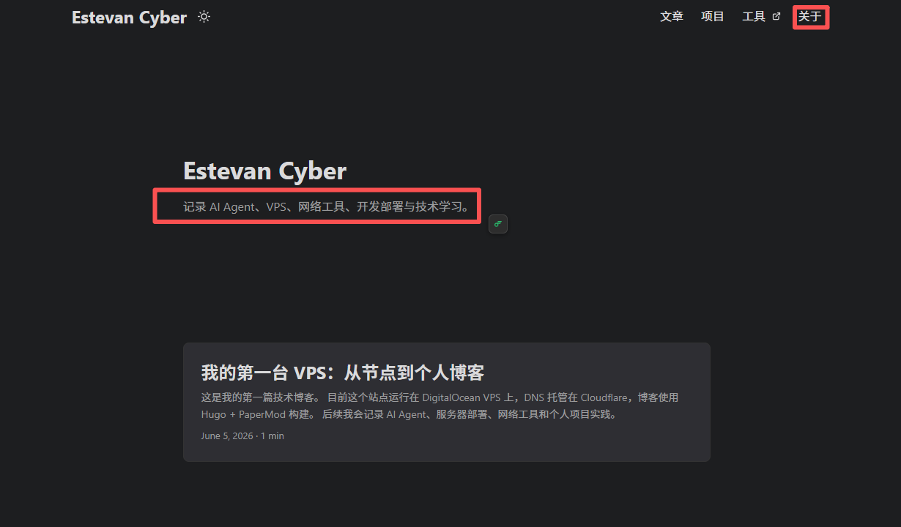

这篇文章记录我把域名接入 Cloudflare，并在 VPS 上搭建个人网站的过程。

最开始我只是想给 VPS 绑定一个正式域名，后来顺手把站点拆成了两个子域名：

```text
blog.estevancyber.net   → 个人博客
tools.estevancyber.net  → 工具页
```

最终形成的结构是：

```text
访客 → Cloudflare → DigitalOcean VPS → Nginx
                         ├── blog.estevancyber.net  → /var/www/blog
                         └── tools.estevancyber.net → /var/www/tools
```

---

## 一、购买域名

我先在 Squarespace 中购买并管理域名。



一开始我对“域名注册商”和“DNS 托管”这两个概念有点混：

- **注册商**：你在哪里买域名。
- **DNS 托管商**：谁来管理这个域名的解析记录。
- **Cloudflare 接管 DNS**：不是转移域名所有权，而是把 Nameserver 改成 Cloudflare 给我的两个地址。

所以我不需要把域名转出 Squarespace，只需要把 Nameserver 改成 Cloudflare 即可。

---

## 二、接入 Cloudflare

在 Cloudflare 中添加域名后，它会分配两个 Nameserver。然后回到域名注册商后台，把原来的 Nameserver 替换成 Cloudflare 的。

我这里最终验证到：

```text
estevancyber.net nameserver = lindsey.ns.cloudflare.com
estevancyber.net nameserver = stan.ns.cloudflare.com
```



这个结果说明：域名的 DNS 权威服务器已经切换到 Cloudflare。

---

## 三、配置 DNS 记录

Cloudflare 接管 DNS 后，我添加了几条记录：

```text
blog   A      VPS 公网 IP
tools  A      VPS 公网 IP
www    CNAME  estevancyber.net
@      A      VPS 公网 IP
```



一开始我全部使用灰云 `DNS only`，方便排错。确认 Nginx 和网站都能正常访问后，再把 `blog` 和 `tools` 切换为橙云 `Proxied`。

需要注意：

- 博客、网站、API 适合走 Cloudflare 橙云。
- SSH、数据库、代理节点、管理后台不要随便走橙云。
- DNS 记录删掉不是关键，关键是 Cloudflare 接管后需要把有用记录重新建好。

---

## 四、整理 Nginx 站点目录

原本 Nginx 默认目录里已经有一个旧工具页面。为了后续维护清晰，我把站点目录整理成：

```text
/var/www/blog   → 博客
/var/www/tools  → 工具页
```

创建目录：

```bash
sudo mkdir -p /var/www/blog
sudo mkdir -p /var/www/tools
```

把旧工具页迁移到 tools：

```bash
sudo cp -r /usr/share/nginx/html/* /var/www/tools/
```

创建临时博客首页：

```bash
echo "Hello, this is Estevan Cyber Blog." | sudo tee /var/www/blog/index.html
```

---

## 五、配置 Nginx 多站点

Nginx 根据不同子域名分发到不同目录。核心配置如下：

```nginx
server {
    listen 80;
    listen [::]:80;
    server_name blog.estevancyber.net;
    return 301 https://$host$request_uri;
}

server {
    listen 443 ssl;
    listen [::]:443 ssl;
    server_name blog.estevancyber.net;

    ssl_certificate /etc/nginx/ssl/estevancyber/origin.pem;
    ssl_certificate_key /etc/nginx/ssl/estevancyber/origin.key;

    root /var/www/blog;
    index index.html;

    location / {
        try_files $uri $uri/ =404;
    }
}
```

tools 子域名同理，只需要把 `server_name` 和 `root` 换成：

```nginx
server_name tools.estevancyber.net;
root /var/www/tools;
```

检查配置并重载：

```bash
sudo nginx -t
sudo systemctl reload nginx
```

---

## 六、配置 HTTPS

我一开始开启 Cloudflare 橙云后遇到了：

```text
Error 525 SSL handshake failed
```

原因是 Cloudflare 到源站服务器的 HTTPS 握手失败。临时可以切到 `Flexible` 恢复访问，但长期更推荐使用：

```text
Cloudflare SSL/TLS → Full (strict)
```

我最后选择了 Cloudflare Origin CA：

1. Cloudflare → SSL/TLS → Origin Server。
2. 创建 Origin Certificate。
3. Hostnames 填：

```text
*.estevancyber.net
estevancyber.net
```

4. 在 VPS 保存为：

```text
/etc/nginx/ssl/estevancyber/origin.pem
/etc/nginx/ssl/estevancyber/origin.key
```

5. 设置权限：

```bash
sudo chmod 600 /etc/nginx/ssl/estevancyber/origin.key
sudo chmod 644 /etc/nginx/ssl/estevancyber/origin.pem
```

这样链路变成：

```text
浏览器 → Cloudflare：HTTPS
Cloudflare → VPS：HTTPS
VPS Nginx → 静态站点目录
```

---

## 七、部署 Hugo + PaperMod 博客

博客使用 Hugo + PaperMod。

创建站点：

```bash
hugo new site estevancyber-blog
cd estevancyber-blog
```

安装 PaperMod：

```bash
git init
git submodule add --depth=1 https://github.com/adityatelange/hugo-PaperMod.git themes/PaperMod
```

配置 `config.yaml`：

```yaml
baseURL: "https://blog.estevancyber.net/"
languageCode: "zh-cn"
title: "Estevan Cyber"
theme: "PaperMod"

params:
  env: production
  defaultTheme: auto
  ShowReadingTime: true
  ShowCodeCopyButtons: true
  ShowToc: true

  homeInfoParams:
    Title: "Estevan Cyber"
    Content: "记录我的 AI Agent 学习、云服务折腾、项目开发与技术成长。"
```

构建并发布：

```bash
hugo
sudo rm -rf /var/www/blog/*
sudo cp -r public/* /var/www/blog/
```

最终博客首页效果如下：



后续我又增加了顶部菜单：



---

## 八、踩坑记录

### 1. Hugo 版本过低

系统 apt 里的 Hugo 版本可能比较旧，新版 PaperMod 可能要求更高版本。我最后安装了 Hugo Extended 新版。

### 2. 配置文件冲突

项目里一度同时存在：

```text
hugo.toml
hugo.yaml
config.yaml
```

这会导致 Hugo 读取配置混乱。最后我只保留 `config.yaml`。

### 3. 图片路径问题

带截图的技术博客更适合 Page Bundle：

```text
content/posts/article-name/
├── index.md
└── image.png
```

文章中写：

```markdown

```

这样图片和文章在一起，迁移和维护都更清楚。

---

## 总结

这次配置让我真正理解了域名、DNS、Cloudflare、Nginx、HTTPS 和 Hugo 之间的关系。

最重要的经验是：

- 先灰云排错，再橙云加速和防护。
- 先让 HTTP 通，再做 HTTPS。
- 先让站点能访问，再做 Full strict。
- 多站点要整理目录，不要一直堆在默认 Nginx 目录里。
- Hugo 博客建议一开始就规划好文章和图片结构。
