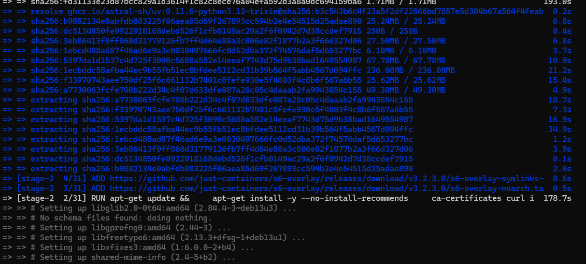
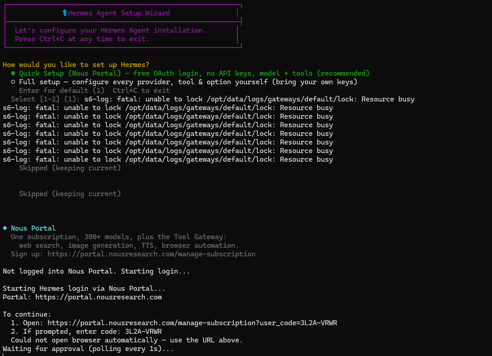
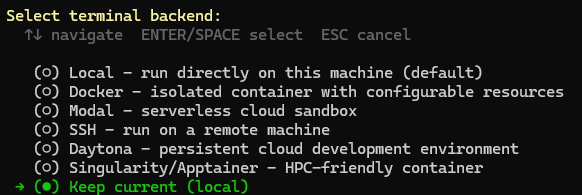
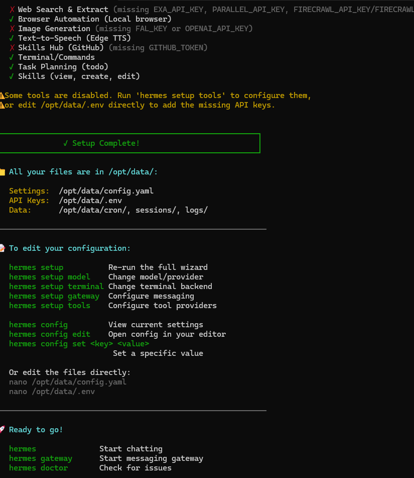

这篇文章记录我在 VPS 上部署 Hermes-agent，并把它接入微信的过程。

最初我只是想在服务器上跑一个可以长期在线的私人 AI Agent。后来发现 Hermes-agent 支持 Docker 部署和消息平台接入，于是就尝试把它接入微信，让它成为一个可以随时对话的私人助手。

最终目标是：

```text
微信 → Hermes Weixin Gateway → Hermes-agent → LLM Provider → 返回回复
```

---

## 一、为什么要在 VPS 上部署 Agent

相比本地运行，VPS 部署有几个好处：

- 24 小时在线
- 不依赖本地电脑开机
- 可以接入微信、Telegram 等消息平台
- 可以逐步扩展成自动化任务中心
- 后续可以和个人博客、API、数据库结合

我的 VPS 已经配置好了 Docker，所以 Hermes-agent 直接使用 Docker 部署。

---

## 二、部署前准备

服务器环境：

```text
Ubuntu 24.04 LTS
Docker
Docker Compose
普通用户 leo
UFW 防火墙
```

先确认 Docker 可用：

```bash
docker run hello-world
```

如果能看到：

```text
Hello from Docker!
```

说明 Docker 已经正常工作。

---

## 三、拉取 Hermes-agent

进入用户目录：

```bash
cd ~
git clone https://github.com/NousResearch/hermes-agent.git
cd hermes-agent
```

启动：

```bash
HERMES_UID=$(id -u) HERMES_GID=$(id -g) docker compose up -d
```

一开始 Docker 会下载和构建镜像，过程可能比较久。



启动后检查容器：

```bash
docker compose ps
```

正常会看到类似：

```text
hermes             gateway      Up
hermes-dashboard   dashboard    Up
```

---

## 四、进入 Hermes Setup

进入配置向导：

```bash
docker compose exec gateway hermes setup
```

Hermes 会出现 Setup Wizard。



这里有两种路线：

- Quick Setup：走 Nous Portal，适合快速开始。
- Full Setup：自己配置模型提供商和工具。

如果使用 OpenRouter，可以选择免费模型或低成本模型进行测试。

---

## 五、选择 Terminal Backend

配置过程中，Hermes 会询问 terminal backend。

我这里选择：

```text
Keep current (local)
```



简单理解：

- Local：在当前 VPS / 容器环境执行。
- Docker：再套一层容器。
- SSH：连接另一台远程机器。
- 云沙盒：适合更复杂场景。

对我当前这个 VPS 单机部署来说，`local` 最简单。

---

## 六、接入微信

进入 Gateway 配置：

```bash
docker compose exec gateway hermes gateway setup
```

选择 Weixin / WeChat 后，按照提示扫码授权。

配置成功后会看到类似：

```text
Weixin configured
Account ID: ...
User ID: ...
```



还可以选择是否把当前微信用户设置为 home channel：


我选择将自己的 Weixin user ID 设置为 home channel。这样 Hermes 就知道默认消息应该发到哪里。

---

## 七、重启 Gateway

配置完成后，不要直接开放公网端口。Docker 部署下，重启 gateway 容器即可：

```bash
docker compose restart gateway
```

查看日志：

```bash
docker logs hermes --tail=100
```

如果微信发消息没有回应，也可以边发消息边看日志：

```bash
docker logs hermes --tail=100
```

---

## 八、踩坑：权限问题

我曾经遇到过日志权限错误：

```text
PermissionError: [Errno 13] Permission denied: '/opt/data/logs/agent.log'
```

原因是容器内 Hermes 用户无法写入挂载目录。修复方法：

```bash
cd ~/hermes-agent
docker compose down

sudo chown -R leo:leo ~/.hermes
chmod -R u+rwX ~/.hermes

rm -f ~/.hermes/logs/gateways/default/lock

HERMES_UID=$(id -u) HERMES_GID=$(id -g) docker compose up -d
```

这个问题解决后，gateway 才能正常写日志并接收消息。

---

## 九、踩坑：gateway profile 问题

后来又遇到过：

```text
no such gateway 'default'
```

我的理解是：profile 和 gateway 还没有正确绑定，或者配置没有被 gateway 容器加载。

排查命令：

```bash
docker compose exec gateway hermes profile list
docker compose exec gateway hermes gateway setup
docker compose restart gateway
```

最终通过重新配置 gateway，并重启 Docker 容器解决。

---

## 十、模型切换

Hermes 跑通后，默认模型可能比较普通。可以通过：

```bash
docker compose exec gateway hermes model
```

切换 provider 和模型。

换完模型后建议重启 gateway：

```bash
docker compose restart gateway
```

---

## 十一、安全原则

Hermes 部署完成后，我没有开放额外公网端口。

当前原则是：

- 不开放 Hermes Dashboard 到公网。
- 不开放 Hermes API 到公网。
- 不把 Bot Token、API Key 发到公开仓库。
- 只通过微信或 SSH 隧道访问。
- 配置文件和密钥只保留在 VPS 本地。

---

## 十二、常用维护命令

进入目录：

```bash
cd ~/hermes-agent
```

查看容器：

```bash
docker compose ps
```

查看日志：

```bash
docker logs hermes --tail=100
docker logs hermes-dashboard --tail=100
```

重启 gateway：

```bash
docker compose restart gateway
```

重新配置模型：

```bash
docker compose exec gateway hermes model
```

重新配置消息平台：

```bash
docker compose exec gateway hermes gateway setup
```

查看诊断：

```bash
docker compose exec gateway hermes doctor
```

---

## 十三、当前成果

目前 Hermes-agent 已经可以通过微信回复消息。

它在我的 VPS 上作为一个长期在线的私人 AI Agent，可以用于：

- 日常问答
- 记录想法
- 辅助学习
- 后续自动化任务
- 与个人项目联动

这也让我对 AI Agent 的理解更具体了：它不只是一个聊天模型，而是一个可以长期运行、连接工具和消息入口的服务。

---

## 总结

这次部署让我理解了几个关键点：

- Docker 很适合部署 AI Agent 服务。
- 消息平台接入比单纯 CLI 更有实际使用价值。
- 日志和权限是排查容器问题的关键。
- 不要一开始就暴露 Dashboard 或 API。
- 先让最小链路跑通，再逐步扩展工具和模型。

下一步我计划继续探索：

- Hermes-agent 的工具调用
- 定时任务
- 与 GitHub / 博客 / API 的联动
- 把它接入自己的 AI Agent 项目实践中
