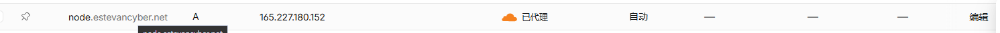
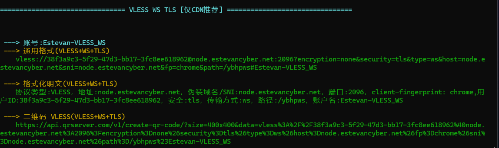
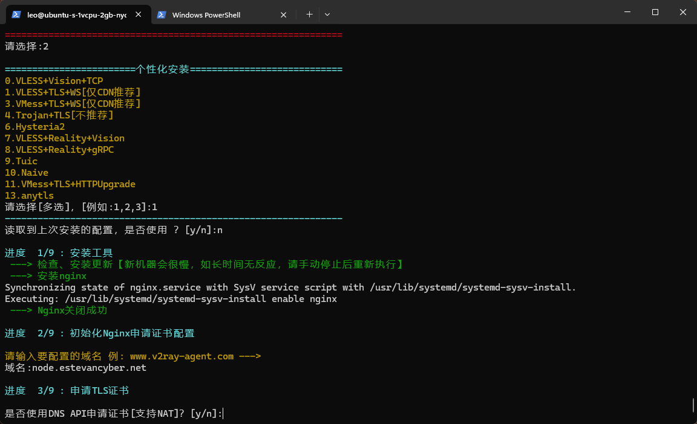
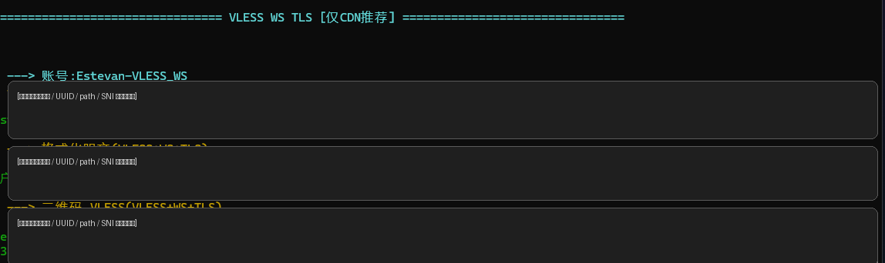
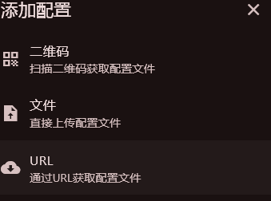
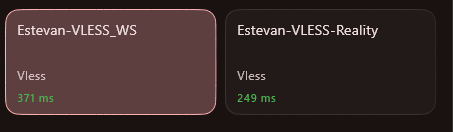

这篇文章记录的是一次比较完整的节点配置与排障过程。

最开始的问题很简单：FlClash 里的节点订阅更新失败。后来我发现，这个问题并不是“节点本体坏了”，而是订阅入口、Nginx、Cloudflare 和脚本生成配置之间混在了一起。最终我把整个结构重新梳理成：

```text
个人网站：
estevancyber.net        → 主页
blog.estevancyber.net   → 博客
tools.estevancyber.net  → 工具页

节点服务：
node.estevancyber.net:2096  → VLESS + WS + TLS + Cloudflare
VPS_IP:19690                → VLESS + Reality + Vision

订阅：
54321 或自维护 YAML 文件 → FlClash 订阅入口
```

这次最大的收获是：**网站、节点、订阅不是一回事，不能全都交给一键脚本混在一起管理。**

---

## 一、最初的问题：订阅更新失败

一开始 FlClash 里更新订阅失败，提示类似“网络异常”。

排查后发现旧订阅链接大概长这样：

```text
http://VPS_IP:443/s/clashMetaProfiles/...
```

问题就在这里：`443` 是 HTTPS 端口，但链接却是 `http://`。

浏览器打开后出现：

```text
400 Bad Request
The plain HTTP request was sent to HTTPS port
```

这说明普通 HTTP 请求被发到了 HTTPS 端口，协议本身就错了。

后来改成 `https://` 又出现 `404`，说明请求进入了 Nginx，但没有命中原来的订阅路径。这个时候我才意识到：后续搭建网站时改过 Nginx，可能已经影响到 v2ray-agent 原本生成的订阅服务。

---

## 二、不要把个人网站和节点订阅混在一起

我的个人网站已经由 Nginx 管理：

```text
80/443 → Nginx
```

同时 Cloudflare 上还有：

```text
estevancyber.net
blog.estevancyber.net
tools.estevancyber.net
```

这些都属于网站服务。

而节点订阅本质上只是一个文本配置文件，给客户端拉取 YAML / ClashMeta 配置使用。它不应该和主页、博客、工具页的 Nginx server block 混在一起。

所以后来我决定：

```text
网站继续走 80/443
节点单独用自己的端口
订阅单独维护
Cloudflare 只代理适合代理的 WebSocket 节点
```

---

## 三、重新配置 CDN 测试节点

为了测试 Cloudflare CDN 路线，我新建了一个子域名：

```text
node.estevancyber.net
```

最开始我把它开成橙云：



但脚本安装时检测域名解析，发现：

```text
当前 VPS IP：165.227.180.152
DNS 解析 IP：104.21.x.x
```

这是因为橙云开启后，DNS 返回的是 Cloudflare 边缘 IP，而不是源站 VPS IP。



所以正确流程是：

```text
安装阶段：node.estevancyber.net 先改灰云，让脚本看到真实 VPS IP
安装完成：再改回橙云，测试 Cloudflare CDN 节点
```

---

## 四、协议选择：为什么选 VLESS + WS + TLS

脚本里有很多协议选项：



如果目标是“套 Cloudflare”，应该选：

```text
VLESS + TLS + WS
```

而不是：

```text
VLESS + Reality
HY2 / Hysteria2
```

原因很简单：

- Reality 更适合直连，不适合走 Cloudflare 橙云。
- HY2 主要走 UDP/QUIC，也不适合普通 Cloudflare CDN。
- WebSocket 是 Cloudflare 支持的 Web 流量形态，最适合用来做 CDN 测试节点。

因此最终我配置了：

```text
域名：node.estevancyber.net
端口：2096
协议：VLESS + WS + TLS
Cloudflare：橙云
```

安装完成后脚本输出了 `vless://` 节点链接。由于里面包含 UUID、路径和连接信息，这里截图已经打码。



---

## 五、FlClash 里的“URL”不是 vless://

FlClash 添加配置时有几个入口：



其中：

```text
URL → 拉取 Clash/Mihomo YAML 配置文件
文件 → 导入本地 YAML 配置文件
二维码 → 扫描配置二维码
```

`vless://` 是单节点分享链接，不是订阅 URL。  
所以直接把 `vless://...` 粘到 URL 里会提示格式不对。

解决方式有两种：

1. 把 `vless://` 转成 Clash/Mihomo YAML，然后通过“文件”导入。
2. 自己在 VPS 上维护一个 YAML 文件，再通过 URL 订阅。

我最终选择第二种思路，因为这样更可控，不再依赖脚本的订阅生成器。

---

## 六、手动添加 Reality 节点

后来我不想只有一个 WS CDN 节点，于是又手动添加了一个 Reality 节点。

目标结构是：

```text
2096  → VLESS + WS + TLS + Cloudflare
19690 → VLESS + Reality + Vision
```

这两个节点可以共存，只要端口不冲突。

### 1. 找到 sing-box 配置位置

通过 systemd 查看 sing-box 启动命令：

```bash
sudo systemctl cat sing-box
```

发现配置文件是：

```text
/etc/v2ray-agent/sing-box/conf/config.json
```

先备份：

```bash
sudo cp /etc/v2ray-agent/sing-box/conf/config.json \
/etc/v2ray-agent/sing-box/conf/config.json.bak-before-reality-$(date +%F-%H%M)
```

### 2. 生成 Reality 参数

```bash
/etc/v2ray-agent/sing-box/sing-box generate uuid
/etc/v2ray-agent/sing-box/sing-box generate reality-keypair
openssl rand -hex 8
```

分别得到：

```text
UUID
Reality Private Key
Reality Public Key
Short ID
```

注意：

- 服务端配置写 `private_key`
- 客户端配置写 `public-key`
- UUID 和 short-id 两边必须完全一致

### 3. 添加 Reality inbound

在 sing-box 的 `inbounds` 中新增一个 VLESS Reality inbound，端口使用：

```text
19690
```

关键字段是：

```json
{
  "type": "vless",
  "tag": "VLESSReality",
  "listen": "::",
  "listen_port": 19690,
  "users": [
    {
      "name": "Estevan-Reality",
      "uuid": "你的UUID",
      "flow": "xtls-rprx-vision"
    }
  ],
  "tls": {
    "enabled": true,
    "server_name": "www.microsoft.com",
    "reality": {
      "enabled": true,
      "handshake": {
        "server": "www.microsoft.com",
        "server_port": 443
      },
      "private_key": "你的PrivateKey",
      "short_id": ["你的ShortID"]
    }
  }
}
```

检查配置：

```bash
sudo /etc/v2ray-agent/sing-box/sing-box check \
-c /etc/v2ray-agent/sing-box/conf/config.json
```

重启：

```bash
sudo systemctl restart sing-box
```

确认端口：

```bash
sudo ss -tulpen | grep -E ":2096|:19690|sing-box"
```

---

## 七、自维护 FlClash YAML 订阅

为了不再依赖脚本生成订阅，我直接维护一个 YAML 文件，例如：

```text
/var/www/sub/estevan.yaml
```

里面同时放两个节点：

```yaml
proxies:
  - name: Estevan-VLESS_WS
    type: vless
    server: node.estevancyber.net
    port: 2096
    uuid: 你的WS节点UUID
    network: ws
    tls: true
    udp: true
    servername: node.estevancyber.net
    client-fingerprint: chrome
    ws-opts:
      path: /你的WS路径
      headers:
        Host: node.estevancyber.net

  - name: Estevan-VLESS-Reality
    type: vless
    server: 你的VPS_IP
    port: 19690
    uuid: 你的Reality节点UUID
    network: tcp
    tls: true
    udp: true
    flow: xtls-rprx-vision
    servername: www.microsoft.com
    client-fingerprint: chrome
    reality-opts:
      public-key: 你的RealityPublicKey
      short-id: 你的RealityShortID
```

再加上分组：

```yaml
proxy-groups:
  - name: PROXY
    type: select
    proxies:
      - Estevan-VLESS-Reality
      - Estevan-VLESS_WS
      - DIRECT

rules:
  - MATCH,PROXY
```

如果想让 FlClash 通过 URL 更新，可以用 Nginx 单独开一个订阅端口，比如：

```text
54321
```

Nginx 配置示例：

```nginx
server {
    listen 54321;
    listen [::]:54321;

    server_name _;

    root /var/www/sub;

    location / {
        try_files $uri =404;
        default_type text/plain;
        add_header Cache-Control "no-store";
    }
}
```

测试：

```bash
curl -I http://127.0.0.1:54321/estevan.yaml
```

返回 `200 OK` 后，FlClash 里填：

```text
http://VPS_IP:54321/estevan.yaml
```

---

## 八、Reality 为什么比 WS CDN 延迟低

最后测试时，Reality 的延迟明显低于 WS CDN：



这其实符合预期。

Reality 的链路是：

```text
客户端 → VPS
```

WS CDN 的链路是：

```text
客户端 → Cloudflare 边缘节点 → VPS
```

Cloudflare 对网站有加速意义，因为它可以缓存图片、CSS、JS 等资源。但代理节点流量不能像网页资源一样被缓存，所以 CDN 节点不一定更快。

因此两个节点的定位应该是：

```text
Reality：
主力直连节点，延迟更低

VLESS WS CDN：
备用路径，适合直连不稳定时使用
```

---

## 九、最终结构

目前比较合理的结构是：

```text
80/443  → Nginx：个人网站、博客、工具页
2096    → VLESS + WS + TLS：Cloudflare CDN 测试节点
19690   → VLESS + Reality + Vision：主力直连节点
54321   → 自维护 YAML 订阅
```

Cloudflare 中：

```text
estevancyber.net        橙云，用于主页
blog.estevancyber.net   橙云，用于博客
tools.estevancyber.net  橙云，用于工具页
node.estevancyber.net   橙云，仅用于 VLESS WS CDN 节点
```

Reality 节点不要使用橙云域名，直接用 VPS IP 或灰云域名。

---

## 总结

这次最大的经验不是“哪个协议最快”，而是理解了几个边界：

- 网站、节点、订阅是三套东西。
- Cloudflare 适合网站和 WS 节点，不适合 Reality / HY2。
- 一键脚本方便，但复杂环境下容易覆盖已有服务。
- Reality 和 VLESS WS 可以共存，只要端口与配置分开。
- FlClash 的 URL 订阅需要 YAML 文件，不是 `vless://` 分享链接。
- 自维护 YAML 订阅虽然麻烦一点，但最可控。

后续如果继续优化，我会优先保留 Reality 作为主力节点，把 WS CDN 当作备用节点，而不是盲目追求“套 CDN”。
